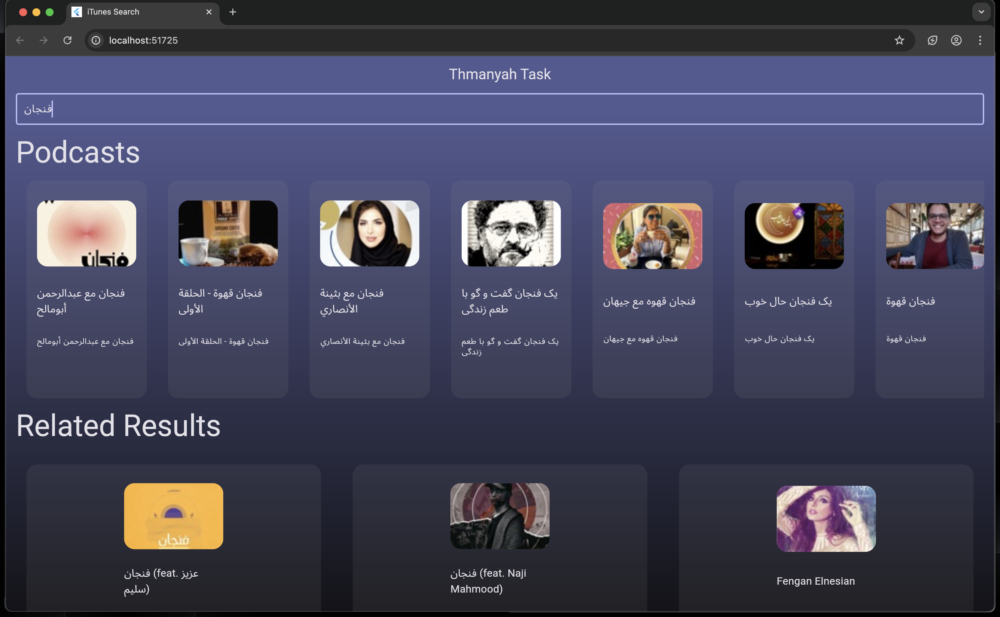
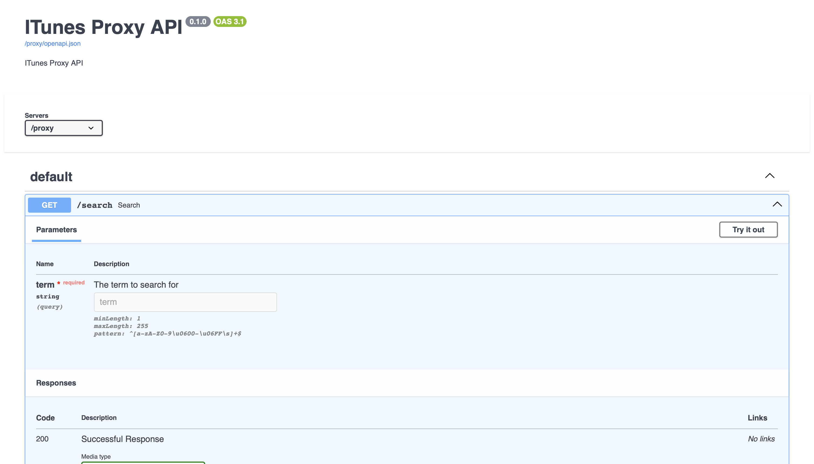

# واجهة البحث - Flutter

واجهة Flutter بسيطة كمكون من مشروع "تكليف مطور متكامل"، تسمح بالبحث باستخدام iTunes API وعرض النتائج بطريقة تفاعلية.

## ⚙️ التقنيات المستخدمة
- Flutter 3.x
- HTTP package
- Provider / Bloc
- Debounce logic باستخدام `Pure Dart`

## 🧠 فكرة المشروع
تطبيق يحتوي على حقل بحث يرسل الكلمة إلى الخادم بعد فترة قصيرة من التوقف عن الكتابة (debounce). يتم جلب النتائج من الخادم وعرضها بالشكل التالي:

- **النتائج من نوع `podcast`**: تُعرض في **قائمة أفقية**.
- **النتائج الأخرى** (مثل موسيقى، أفلام... إلخ): تُعرض في **قائمة رأسية**.

## 📸 صورة من التطبيق

> 

## 🔍 طريقة التشغيل

```bash
flutter pub get
flutter run
```
## 
# ITunes Proxy API - FastAPI Backend

هذا هو الجزء الخلفي (backend) من مشروع "تكليف مطور متكامل"، تم تطويره باستخدام FastAPI ويقوم بالتالي:

- استقبال كلمة بحث.
- الاستعلام من iTunes Search API.
- تخزين النتائج في قاعدة بيانات (Postgres).
- إعادة النتائج إلى الواجهة بصيغة منظمة.

---

## 🏗️ هيكل المشروع

```plaintext
.
├── controllers/
│   └── itunes_controller.py
├── models/
│   └── content_model.py
├── repositories/
│   ├── content_repo.py
│   └── itunes_repo.py
├── schemas/
│   ├── content_schema.py
│   └── response_schemas/
│       └── search_res_schema.py
├── migrations/
│   └── versions/8948922bd53d_content.py
│
└── main.py
```

## ⚙️ طريقة التشغيل

### 1. تثبيت المتطلبات

```bash
pip install -r requirements.txt
```
### 2. تجهيز قاعدة البيانات باستخدام Alembic
```bash
alembic upgrade head
```

### 3. تشغيل FastAPI
```bash
uvicorn main:app --reload
```

# 📡 مثال على طلب بحث
```bash
curl "http://localhost:8000/proxy/search?term=فنجان"
```

# استجابة (JSON)
```json
{
  "code": 200,
  "resultCount": 50,
  "results": [
    {
      "wrapperType": "track",
      "kind": "podcast",
      "artistName": "فنجان مع عبد الرحمن أبو مالح",
      "collectionName": "بودكاست فنجان",
      "trackName": "حلقة 1",
      "collectionId": 123456789,
      "trackId": 987654321,
      ...
    }
  ]
}
```

## او يمكنك استخدام (OpenAPI) لواجهة رسومية افضل
```bash
http://localhost:8000/docs
```

## 📸 صورة من OpenAPI
> 